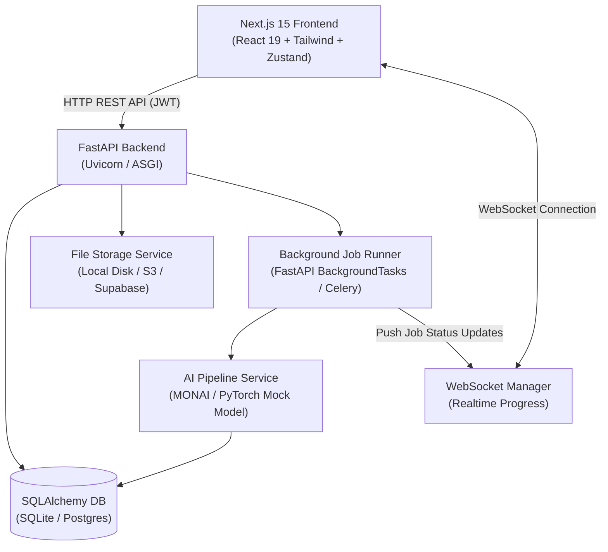

# 🧠 OncoTwin – AI Neuro-Oncology Digital Twin Platform

[](https://fastapi.tiangolo.com/)
[](https://nextjs.org/)
[](https://react.dev/)
[](https://www.typescriptlang.org/)
[](https://www.python.org/)
[](https://www.docker.com/)

**OncoTwin** is a full-stack, end-to-end neuro-oncology digital twin application. It simulates the clinical lifecycle of brain tumor analysis: **User Authentication ➔ Patient Management ➔ MRI Upload & Validation ➔ Realtime WebSocket-driven AI Segmentation ➔ Radiomics Analytics ➔ Growth Prediction ➔ Interactive 3D Visualizations**.

> [!NOTE]
> **Clinical review architecture with transparent model status**: Every workflow calls real REST/WebSocket API endpoints backed by a database. Uploaded NIfTI volumes are rendered as authenticated axial reference slices in the report. The current local model is a deterministic fallback until a validated clinical segmentation model is configured; results are decision support, not a standalone diagnosis.

---

## 🚀 Key Features & Vertical Slice

- 🔐 **Authentication & Security**: JWT-based sign up, login, password hashing (Passlib/Bcrypt), and protected API endpoints.
- 📋 **Patient Management**: Full CRUD operations, filtering, patient history, and clinical metadata search.
- 📁 **MRI Imaging Ingestion**: Drag-and-drop file upload supporting `.nii`, `.nii.gz`, and `.zip` archives with MIME and structural validation.
- ⚡ **Realtime AI Pipeline Execution**: Asynchronous job queue with streaming status updates, progress percentages, and log messages delivered over WebSockets (`/ws/jobs/{job_id}`).
- 📊 **Segmentation & Radiomics**: Automated calculations of tumor volume ($\text{cm}^3$), surface area, sphericity, confidence scores, and sub-region breakdown (ET, ED, NCR/NET).
- 📈 **Digital Twin Growth Modeling**: Interactive trajectory modeling projecting tumor growth across 30, 60, and 90-day intervals.
- 🧠 **Clinical Imaging Review**: Authenticated axial reference slice rendered directly from the uploaded NIfTI volume, with orientation and source-quality context.
- 🎨 **Modern UX/UI Design**: Responsive UI with dark/light mode toggle, dynamic loading skeletons, glassmorphism aesthetics, and smooth transitions.
- 🧪 **Automated Testing Suite**: End-to-end pytest test coverage for authentication, patient management, scan uploads, and inference workflows.

---

## 🏗️ System Architecture



### Directory Overview

```
oncotwin/
├── backend/                  # FastAPI Application
│   ├── app/
│   │   ├── api/routes/       # REST Routes (auth, patients, upload, predict)
│   │   ├── core/             # Configuration & Security (JWT, Hashing)
│   │   ├── db/               # Database Engine & Session Management
│   │   ├── models/           # SQLAlchemy Models (User, Patient, Scan, Job)
│   │   ├── schemas/          # Pydantic Request & Response Schemas
│   │   ├── services/         # AI Pipeline, File Storage, & WebSocket Manager
│   │   ├── workers/          # Background Task Runner
│   │   ├── seed.py           # Database Seeder (Demo User & Sample Data)
│   │   └── tests/            # Pytest Suite
│   ├── Dockerfile
│   └── requirements.txt
├── frontend/                 # Next.js 15 App Router
│   ├── app/                  # Router Pages (auth, dashboard, patients, upload, results)
│   ├── components/           # UI Components (Tumor Visualization, Shell, Cards, Buttons)
│   ├── lib/                  # Typed API Client, Auth Store (Zustand), WebSocket Hook
│   ├── Dockerfile
│   └── package.json
└── docker-compose.yml        # Multi-container Orchestration
```

---

## 🛠️ Quickstart Guide

### Option A: Docker Compose (Recommended)

Run the entire full-stack application (Frontend + Backend + Database) with a single command:

```bash
docker compose up --build
```

- 🌐 **Frontend App**: [http://localhost:3000](http://localhost:3000)
- 📜 **Interactive API Docs (Swagger)**: [http://localhost:8000/docs](http://localhost:8000/docs)
- 🔍 **ReDoc API Documentation**: [http://localhost:8000/redoc](http://localhost:8000/redoc)

---

### Option B: Manual Local Setup

#### One-command startup

From the repository root, run:

```bash
bash start-local.sh
```

This creates or reuses `.venv`, installs backend and frontend dependencies, creates local environment files when needed, and starts both services.

#### 1. Backend Setup

```bash
cd backend

# Create and activate virtual environment
python3 -m venv .venv
source .venv/bin/activate

# Install dependencies
pip install -r requirements.txt

# Configure environment variables
cp .env.example .env

# (Optional) Seed the database with demo account & sample patients
python -m app.seed

# Start Uvicorn development server
uvicorn app.main:app --reload --port 8000
```

#### 2. Frontend Setup

```bash
cd frontend

# Install dependencies
npm install

# Configure environment variables
cp .env.example .env.local

# Run Next.js dev server
npm run dev
```

> [!TIP]
> **Demo Account Credentials**:
> - **Email**: `demo@oncotwin.com`
> - **Password**: `OncoTwinDemo2026!`

---

## 🧪 Testing

Run backend automated tests with `pytest`:

```bash
cd backend
pytest app/tests/ -v
```

---

## 🧩 Production Swap & Modular Architecture Matrix

OncoTwin is designed using clean interface abstractions. Local defaults require zero external credentials and can be swapped for production cloud services by changing single files:

| Concern | Local Default | Production Cloud Swap | Target Implementation File |
| :--- | :--- | :--- | :--- |
| **Database** | SQLite (`oncotwin.db`) | Supabase / PostgreSQL | [`backend/app/core/config.py`](file:///Users/sambhramsattigeri/Documents/oncotwin/backend/app/core/config.py) (`DATABASE_URL`) |
| **Authentication** | Self-Issued JWT | Supabase Auth / Auth0 | [`backend/app/core/security.py`](file:///Users/sambhramsattigeri/Documents/oncotwin/backend/app/core/security.py) |
| **File Storage** | Local Disk (`./storage`) | AWS S3 / Supabase Storage | [`backend/app/services/storage.py`](file:///Users/sambhramsattigeri/Documents/oncotwin/backend/app/services/storage.py) |
| **Background Jobs** | FastAPI `BackgroundTasks` | Celery + Upstash Redis | [`backend/app/workers/tasks.py`](file:///Users/sambhramsattigeri/Documents/oncotwin/backend/app/workers/tasks.py) |
| **AI Segmentation** | `MockSegmentationModel` | MONAI / PyTorch Model | [`backend/app/services/ai_pipeline.py`](file:///Users/sambhramsattigeri/Documents/oncotwin/backend/app/services/ai_pipeline.py) |
| **3D Rendering** | CSS Volumetric Render | Cornerstone3D / Three.js | [`frontend/components/tumor-visualization.tsx`](file:///Users/sambhramsattigeri/Documents/oncotwin/frontend/components/tumor-visualization.tsx) |

---

## 🌐 Deployment Instructions

- **Frontend (Vercel)**: Connect repository, select root folder `frontend`, set `NEXT_PUBLIC_API_URL` and `NEXT_PUBLIC_WS_URL`.
- **Backend (Render / Railway)**: Deploy web service using `backend/Dockerfile`. Configure environment variables matching `backend/.env.example`.
- **Database / Auth (Supabase)**: Provision PostgreSQL database, update `DATABASE_URL` in environment variables.

---

## 📄 License

This project is licensed under the [MIT License](LICENSE).

