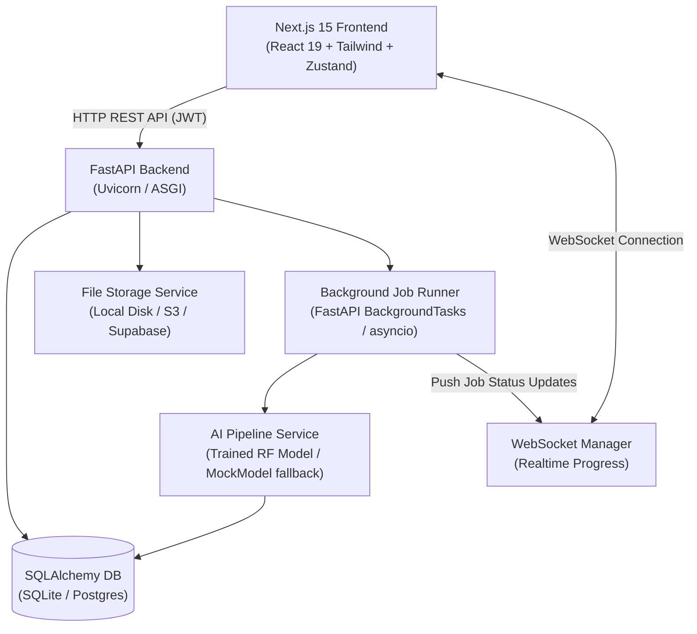

# 🧠 OncoTwin – AI Neuro-Oncology Digital Twin Platform

[](https://fastapi.tiangolo.com/)
[](https://nextjs.org/)
[](https://react.dev/)
[](https://www.typescriptlang.org/)
[](https://www.python.org/)
[](https://www.docker.com/)

**OncoTwin** is a full-stack, end-to-end neuro-oncology digital twin application. It simulates the clinical lifecycle of brain tumor analysis: **User Authentication ➔ Patient Management ➔ MRI Upload & Validation ➔ Realtime WebSocket-driven AI Segmentation ➔ Radiomics Analytics ➔ Growth Prediction ➔ Interactive 3D Visualizations**.

> [!NOTE]
> **Clinical review architecture with transparent model status**: Every workflow calls real REST/WebSocket API endpoints backed by a database. Uploaded NIfTI volumes are rendered as authenticated axial reference slices in the report. The current local model is a deterministic fallback until a validated clinical segmentation model is configured; results are decision support, not a standalone diagnosis.

---

## 🚀 Key Features & Vertical Slice

- 🔐 **Authentication & Security**: JWT-based sign up, login, password hashing (Passlib/Bcrypt), and protected API endpoints.
- 📋 **Patient Management**: Full CRUD operations, filtering, patient history, and clinical metadata search.
- 📁 **MRI Imaging Ingestion**: Drag-and-drop file upload supporting `.nii`, `.nii.gz`, and `.zip` archives with MIME and structural validation.
- ⚡ **Realtime AI Pipeline Execution**: Asynchronous job queue with streaming status updates, progress percentages, and log messages delivered over WebSockets (`/api/v1/ws/jobs/{job_id}`).
- 📊 **Segmentation & Radiomics**: Automated calculations of tumor volume, surface area, sphericity, confidence scores, and sub-region breakdown (ET, ED, NCR/NET).
- 📈 **Digital Twin Growth Modeling**: Interactive trajectory modeling projecting tumor growth across 30, 60, and 90-day intervals.
- 🧠 **Clinical Imaging Review**: Authenticated axial reference slice rendered directly from the uploaded NIfTI volume, with orientation and source-quality context.
- 🎨 **Modern UX/UI Design**: Responsive UI with dark/light mode toggle, dynamic loading skeletons, glassmorphism aesthetics, and smooth transitions.
- 🧪 **Automated Testing Suite**: End-to-end pytest test coverage for authentication, patient management, scan uploads, and inference workflows.

---

## 🏗️ System Architecture



### Directory Overview

```
oncotwin/
├── backend/                  # FastAPI Application
│   ├── app/
│   │   ├── api/routes/       # REST Routes (auth, patients, upload, predict, dashboard, analytics)
│   │   ├── core/             # Configuration & Security (JWT, Hashing)
│   │   ├── db/               # Database Engine & Session Management
│   │   ├── ml/               # Trained ML Model (feature extractor, train script, inference)
│   │   ├── models/           # SQLAlchemy Models (User, Patient, Scan, Job)
│   │   ├── schemas/          # Pydantic Request & Response Schemas
│   │   ├── services/         # AI Pipeline, File Storage, & WebSocket Manager
│   │   ├── workers/          # Background Task Runner (asyncio-based)
│   │   ├── seed.py           # Database Seeder (Demo User & Sample Data)
│   │   └── tests/            # Pytest Suite
│   ├── Dockerfile
│   └── requirements.txt
├── frontend/                 # Next.js 15 App Router
│   ├── app/                  # Router Pages (auth, dashboard, patients, upload, results)
│   ├── components/           # UI Components (Tumor Visualization, Shell, Cards, Buttons)
│   ├── lib/                  # Typed API Client, Auth Store (Zustand), WebSocket Hook
│   ├── Dockerfile            # Multi-stage build with NEXT_PUBLIC_ ARG support
│   └── package.json
├── docker-compose.yml        # Multi-container Orchestration
└── start-local.sh            # One-command local dev startup (with --reload)
```

---

## 🛠️ Quickstart Guide

### Option A: Docker Compose (Recommended)

Run the entire full-stack application (Frontend + Backend + Database) with a single command:

```bash
docker compose up --build
```

> [!IMPORTANT]
> **`NEXT_PUBLIC_*` variables are baked at build time** in Next.js. The `docker-compose.yml` passes them as Docker build args so they are embedded correctly during `npm run build`. If you need to change the backend URL for a remote deployment, update both `build.args` and `environment` in `docker-compose.yml` before running `docker compose up --build`.

- 🌐 **Frontend App**: [http://localhost:3000](http://localhost:3000)
- 📜 **Interactive API Docs (Swagger)**: [http://localhost:8000/docs](http://localhost:8000/docs)
- 🔍 **ReDoc API Documentation**: [http://localhost:8000/redoc](http://localhost:8000/redoc)

---

### Option B: Manual Local Setup

#### One-command startup

From the repository root, run:

```bash
bash start-local.sh
```

This creates or reuses `.venv`, installs backend and frontend dependencies, creates local environment files when needed, and starts both services. The backend runs with `--reload` for hot-reloading during development.

#### 1. Backend Setup

```bash
cd backend

# Create and activate virtual environment
python3 -m venv .venv
source .venv/bin/activate

# Install dependencies
pip install -r requirements.txt

# Configure environment variables
cp .env.example .env

# (Optional) Seed the database with demo account & sample patients
python -m app.seed

# Start Uvicorn development server (with hot-reload)
uvicorn app.main:app --reload --host 0.0.0.0 --port 8000
```

#### 2. Frontend Setup

```bash
cd frontend

# Install dependencies
npm install

# Configure environment variables
cp .env.example .env.local

# Run Next.js dev server
npm run dev
```

> [!TIP]
> **Demo Account Credentials**:
> - **Email**: `demo@oncotwin.com`
> - **Password**: `OncoTwinDemo2026!`

---

## 🧪 Testing

Run backend automated tests with `pytest`:

```bash
cd backend
pytest app/tests/ -v
```

All 5 tests should pass: signup/login, wrong-password rejection, patient CRUD, auth enforcement, and scan upload + job creation.

---

## 🐛 Known Issues & Bug Fixes Applied

The following bugs were identified and fixed:

| # | Bug | Fix Applied |
|---|-----|-------------|
| 1 | **`NEXT_PUBLIC_*` env vars baked at build time** — Docker Compose `environment:` block only sets runtime env, so Next.js would use the default hardcoded values instead of the compose-configured URL | Added `build.args` in `docker-compose.yml` and `ARG`/`ENV` declarations in `frontend/Dockerfile` so vars are available during `npm run build` |
| 2 | **Blocking `time.sleep()` inside async function** — `tasks.py` called `time.sleep(0.2)` inside `async def run_processing_job()`, blocking the entire event loop and preventing WebSocket broadcasts from firing during job step updates | Replaced with `await asyncio.sleep(0.2)` |
| 3 | **Pydantic v2 protected namespace warning** — `DashboardStats.model_version` field name conflicted with Pydantic's protected `model_` namespace, emitting a `UserWarning` on every startup | Added `model_config = ConfigDict(protected_namespaces=())` to `DashboardStats` |
| 4 | **Deprecated Pydantic v1 `class Config`** — `ScanResponse` and `JobResponse` used the v1-style `class Config: from_attributes = True` pattern which is deprecated in Pydantic v2 | Replaced with `model_config = ConfigDict(from_attributes=True)` |
| 5 | **No `--reload` in dev script** — `start-local.sh` ran uvicorn without `--reload`, requiring manual restarts on every backend code change | Added `--reload` flag to uvicorn in `start-local.sh` |

> [!WARNING]
> **Python 3.13+ compatibility**: `passlib 1.7.4` imports Python's deprecated `crypt` module, which is removed in Python 3.13. If you upgrade to Python 3.13+, replace `passlib` with `pwdlib` or use `bcrypt` directly for password hashing.

---

## 🧩 Production Swap & Modular Architecture Matrix

OncoTwin is designed using clean interface abstractions. Local defaults require zero external credentials and can be swapped for production cloud services by changing single files:

| Concern | Local Default | Production Cloud Swap | Target Implementation File |
| :--- | :--- | :--- | :--- |
| **Database** | SQLite (`oncotwin.db`) | Supabase / PostgreSQL | [`backend/app/core/config.py`](backend/app/core/config.py) (`DATABASE_URL`) |
| **Authentication** | Self-Issued JWT | Supabase Auth / Auth0 | [`backend/app/core/security.py`](backend/app/core/security.py) |
| **File Storage** | Local Disk (`./storage`) | AWS S3 / Supabase Storage | [`backend/app/services/storage.py`](backend/app/services/storage.py) |
| **Background Jobs** | FastAPI `BackgroundTasks` | Celery + Upstash Redis | [`backend/app/workers/tasks.py`](backend/app/workers/tasks.py) |
| **AI Segmentation** | `MockSegmentationModel` | Trained RF / MONAI / PyTorch | [`backend/app/services/ai_pipeline.py`](backend/app/services/ai_pipeline.py) |
| **3D Rendering** | CSS Volumetric Render | Cornerstone3D / Three.js | [`frontend/components/tumor-visualization.tsx`](frontend/components/tumor-visualization.tsx) |

### Training the Local ML Model

The backend ships with a real scikit-learn Random Forest model. To train it on synthetic data:

```bash
cd backend
python -m app.ml.train
```

Once trained, `app/ml/artifacts/model.joblib` is created and automatically loaded by the AI pipeline instead of the mock fallback model.

---

## 🌐 Deployment Instructions

- **Frontend (Vercel)**: Connect the repository, select `frontend` as the root directory, and add these Production environment variables:
    ```env
    NEXT_PUBLIC_API_URL=https://oncotwin-3tik.onrender.com
    NEXT_PUBLIC_WS_URL=wss://oncotwin-3tik.onrender.com
    ```
    These values are embedded during the Vercel build, so redeploy the frontend after adding or changing them. Do not use `localhost` here: in a deployed browser, `localhost` means the visitor's computer.
- **Backend (Render)**: Create a Web Service using `backend/Dockerfile`, set its health check or public URL, and configure the variables in `backend/.env.example`. Set `CORS_ORIGINS` to the exact Vercel URL, for example:
    ```env
    CORS_ORIGINS=["https://onco-twin-six.vercel.app"]
    ```
- **Persistent uploads**: `UPLOAD_DIR` uses the local filesystem by default. On Render, attach a persistent disk mounted at `/app/storage` and set `UPLOAD_DIR=/app/storage/uploads`; otherwise uploaded scans can disappear when the service restarts. The database also needs a persistent PostgreSQL service such as Supabase rather than the default SQLite file.
- **Database / Auth (Supabase)**: Provision PostgreSQL and set `DATABASE_URL` on Render. The current app continues to use its built-in JWT auth; keep `JWT_SECRET` set to a long random production value.

> [!TIP]
> After deployment, open the Render URL in a browser and confirm it returns `{"name":"OncoTwin API","status":"ok"}`. Then log in to the Vercel site and upload a scan. If the upload request fails, check the browser Network tab for the request URL: it must start with your Render URL, never `localhost`.

---

## 🔧 Troubleshooting

### Server not reachable / "Unable to connect to backend server"

1. **Local dev**: Verify the backend is running and healthy:
   ```bash
   curl http://localhost:8000/api/v1/health
   # Expected: {"status":"healthy"}
   ```
2. **Port conflict**: Check if port 8000 is already in use: `lsof -i :8000`. Kill any conflicting process before starting.
3. **Docker**: After any code changes, always rebuild: `docker compose up --build` (not just `docker compose up`).
4. **CORS error**: If the frontend domain is not listed in `CORS_ORIGINS`, update `backend/.env` and restart the backend.
5. **Virtual environment**: `start-local.sh` uses the root-level `.venv`. When running the backend manually, activate `.venv` and run uvicorn from inside the `backend/` directory.

### Uploads fail on the deployed site

1. In Vercel, verify `NEXT_PUBLIC_API_URL` points to the Render HTTPS URL and `NEXT_PUBLIC_WS_URL` points to the same host with `wss://`.
2. Redeploy Vercel after changing either variable because Next.js embeds `NEXT_PUBLIC_*` values at build time.
3. In Render, verify `CORS_ORIGINS` contains the exact Vercel origin, with no trailing slash.
4. Verify the Render service is running and its root URL returns the healthy response described above.
5. Configure a Render persistent disk for `/app/storage` before relying on uploaded scans across restarts.

### WebSocket progress not updating

The WebSocket endpoint is `wss://your-backend.onrender.com/api/v1/ws/jobs/{job_id}` in production and `ws://localhost:8000/api/v1/ws/jobs/{job_id}` locally. Verify:
- The backend is reachable via HTTP first (`/api/v1/health`).
- No proxy or firewall is stripping WebSocket `Upgrade` headers.

---

## 📄 License

This project is licensed under the [MIT License](LICENSE).
